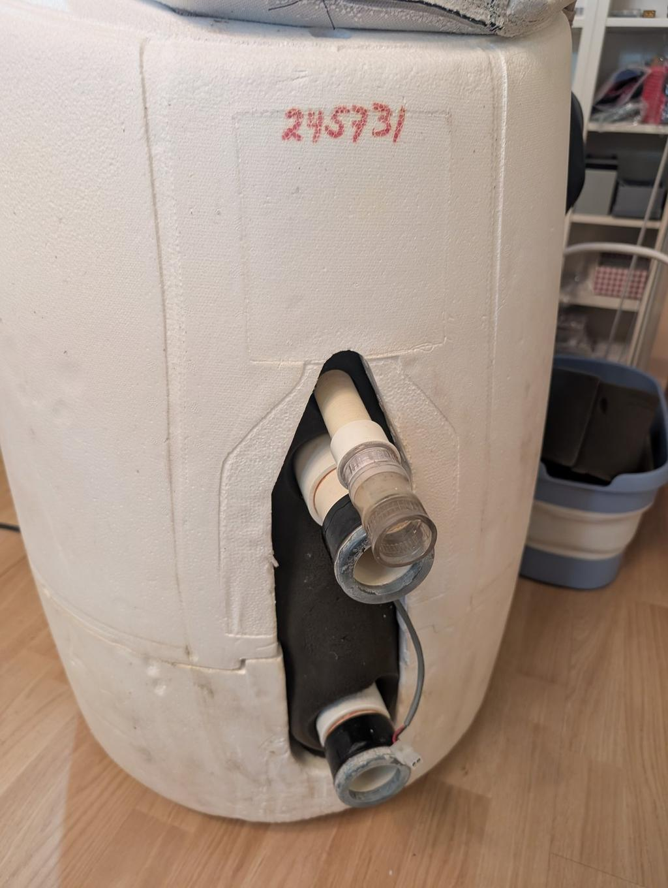
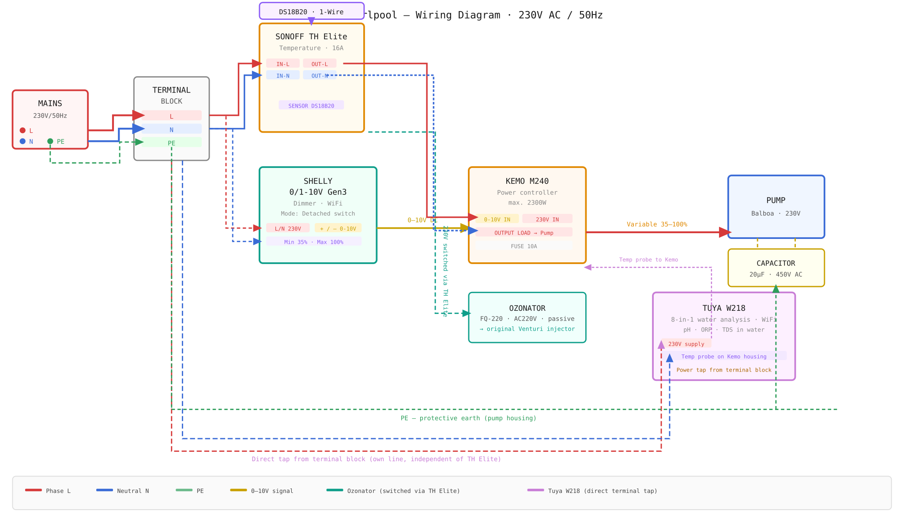

# Softub Whirlpool Smart Conversion

## Table of Contents

- [Motivation](#motivation)
- [Components](#components)
- [Quick Start](#quick-start)
- [Disclaimer & Safety](#disclaimer--safety)

## Motivation

The Softub Legend (~10 years old) stopped working: the motor wouldn't start and the JET button on the topside panel showed no reaction. The motor had intermittent starting difficulties before the complete failure.

The official service partner diagnosed a defective control board plus an age-related capacitor and quoted **CHF 1,100** for the repair (negotiated down to CHF 1,000). The capacitor alone was quoted at CHF 99. Balboa Water Group confirmed that the pump (part 1019230, motor 1114033 — MTR USM 1660 1HP 1SP 5.4A HV/50Hz) is a custom unit made exclusively for Softub and is **discontinued** with no modern replacement available.

Rather than paying CHF 1,000+ for a like-for-like repair of a proprietary, non-repairable control board with no remote control and only on/off pump operation, the entire control system was replaced with off-the-shelf smart home components for **under CHF 185** (see [bill of materials](bom/bill-of-materials.md)). The original Balboa motor was kept — only the control electronics were replaced. A Sonoff TH Elite handles temperature-based switching and powers the pump, ozonator, and Isonic ozone valve, a corona-discharge ozonator handles automatic disinfection via the original Venturi injector (chlorine tabs are added manually as needed, same as pH-plus/minus), and a Tuya WiFi water analyzer keeps live pH/ORP/TDS readings without any proprietary app.

> **Status:** Personal project, documented as I build it. Currently private while I finish testing; will be opened up once the build is stable.

*[Download the interactive HTML version](diagrams/wiring-diagram.html) for a richer view with notes — open in any browser.*

The new system is:

- **Repairable** — every part is a standard, replaceable component, not a proprietary board
- **Remotely controllable** — temperature and water chemistry are visible and controllable from a phone

## Components

| Function                            | Component                                                   |
| ----------------------------------- | ----------------------------------------------------------- |
| Temperature control / main switch   | Sonoff TH Elite + DS18B20 probe                             |
| Ozone disinfection                  | FQT-124 corona-discharge ozonator + Isonic V1C06-AY1 valve (original Venturi injector reused) |
| Water chemistry monitoring          | Tuya W218 (pH / ORP / TDS), temp probe in electronics cabinet |
| Distribution                        | Terminal block, Wago lever connectors, waterproof gel boxes |

See [docs/COMPONENTS.md](docs/COMPONENTS.md) for what each part does and why it was chosen, and [bom/bill-of-materials.md](bom/bill-of-materials.md) for the full parts list with sources and prices.

## Quick Start

1. Read the [Disclaimer & Safety](#disclaimer--safety) section below — this project involves 230V mains wiring.
2. Review the [wiring diagram](diagrams/wiring-diagram.html) (open in any browser).
3. Follow [docs/GUIDE.md](docs/GUIDE.md) for the build sequence.
4. Check the [bill of materials](bom/bill-of-materials.md) for exact parts.

## Disclaimer & Safety

> **This project involves 230V AC mains wiring. Incorrect wiring can cause fire, electric shock, or death.**

This is a personal DIY project by a hobbyist — **not** a licensed electrician and **not** an electrical engineer. It has not been professionally reviewed, certified, or inspected. The wiring, component choices, and design documented here may contain errors. This is not a UL/CE/IEC-certified design.

- **No liability.** The author accepts no responsibility for injury, death, property damage, fire, or any other loss resulting from replicating, adapting, or referencing this project.
- **No guarantee of correctness.** Use this as a reference, not as an instruction manual.
- **Local regulations apply.** Electrical codes vary by country and region. What is described here may not be legal or compliant in your jurisdiction.
- **Insurance and warranty.** DIY modifications to mains-powered appliances may void the manufacturer's warranty and affect your home or liability insurance.
- **Hire a professional.** If you are not confident working with mains voltage, hire a qualified electrician. At minimum, have one inspect your wiring before energizing it.

### Safety Rules Followed in This Build

- Always unplug before touching anything — never just switch off.
- Upstream 30mA RCD/GFCI is mandatory.
- Discharge the pump capacitor (CBB60, 450V) before handling.
- **Wire colours verified with a multimeter, never assumed from colour alone.** Components in this build use conflicting regional conventions — the motor uses US colours (black = neutral, white = live) while the ozonator uses the exact opposite. Neither matches EU convention (brown/blue). The original motor wiring was also in poor condition (corroded spade terminals, degraded insulation) and needed repairing before reconnecting.

- Protective earth (PE) connected on every metal enclosure.
- Low-voltage signal wiring physically separated from 230V wiring.
- All connectors inside the motor housing use sealed gel-box connectors (Wago) — condensation is routine, not an edge case.

### If You Replicate This Project

- Have a qualified electrician inspect your wiring before first power-up.
- Test incrementally with a multimeter at each stage, not all at once.
- Keep the whirlpool empty of water during initial dry testing.
