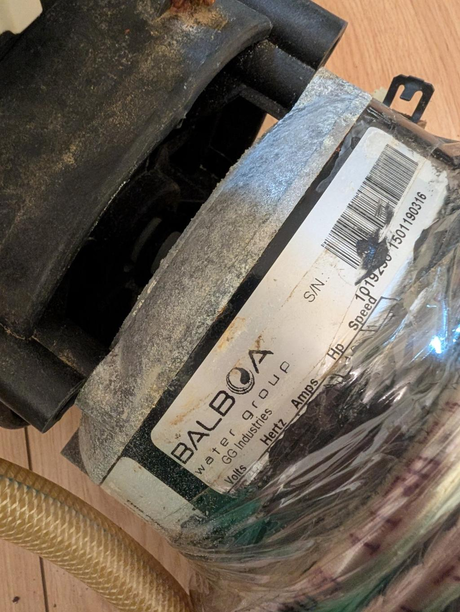

# Components

## Table of Contents

- [Control & Smart Home](#control--smart-home)
- [Pump & Motor](#pump--motor)
- [Water Treatment](#water-treatment)
- [Distribution & Wiring](#distribution--wiring)
- [Tools Used](#tools-used)

What each part does, why it was chosen, and what it replaced.

> The active control and sensor components (TH Elite, Tuya W218) are WiFi-native devices, chosen deliberately so they can later be brought into an existing Home Assistant setup for unified dashboards and automations, rather than being locked into separate single-purpose apps.

## Control & Smart Home

### Sonoff TH Elite
The master switch for the whole system. Reads water temperature via the DS18B20 probe and switches 230V to everything downstream (pump, ozonator, and Isonic valve) once a target temperature is reached. Rated 16A, well above what the pump draws.

Replaces: the original Softub control board's temperature logic, which lived on a sealed, non-repairable PCB.

### DS18B20 Temperature Probe
Waterproof 1-Wire digital temperature sensor, wired into the TH Elite's dedicated sensor input. Needs a 4.7kΩ pull-up resistor between data and VCC.

### Isonic V1C06-AY1 Magnetic Valve
Normally-closed 12VDC solenoid valve, reused from the original Softub installation. Sits between the ozonator and the Venturi injector, powered from the TH Elite's switched output via a cheap 12V DC power supply (any small 12VDC adapter will do — widely available from many sources). When the TH Elite relay closes, the valve opens and allows the Venturi vacuum (created by the running pump) to pull ozone into the water.

## Pump & Motor

### Original Balboa Motor

Kept from the original installation. Custom pump made by Balboa Water Group (GG Industries) exclusively for Softub — confirmed discontinued by Balboa with no modern replacement available.

- **Pump:** 1019230 — UL USM 1HP 1SP 16FT HV/50Hz SOFTUB
- **Motor:** 1114033 — MTR USM 1660 1HP 1SP 5.4A HV/50Hz

Single-phase induction motor with a separate run capacitor terminal. US-style wire colour convention (black = neutral, white = live on this particular unit — verified by resistance measurement, not assumed, since this is the opposite of EU convention and also opposite of the colour convention used by the ozonator, on the same build).

### CBB60 Run Capacitor (20µF, 450VAC)

<!-- TODO: add photo of new CBB60 replacement capacitor with crimped spade connectors -->

Replacement for the original (failed) capacitor. Has two pairs of spade terminals (each pair electrically identical, just doubled for easier wiring) — only one terminal per pair is used; the spare is insulated, not left bare.

## Water Treatment

### Ozonator (FQT-124, Corona Discharge)
Replaces the original AquaSunOzone XL-30 (12V DC, which required the now-removed Aquatemp transformer to run). The FQT-124 is a corona-discharge ozone generator with no internal air pump. Switched by the TH Elite together with the pump and Isonic magnetic valve — all three power on and off with the temperature relay. It cannot push ozone into the water by itself — it relies entirely on the Venturi effect from the original Softub plumbing (Venturi injector and check valve are both reused from the factory installation), which draws a vacuum and pulls the ozone gas through the Isonic valve and into the water when the pump is running.

Chlorine tabs are also used, dosed reactively as needed (same cadence as pH-plus/minus) rather than continuously — ozone via the Venturi remains the automatic/always-on sanitizer, chlorine is a manual supplement.

**Replaced once so far** — same model, same [AliExpress listing](https://de.aliexpress.com/item/1005008049726105.html), ~40 CHF. Corona-discharge ozonators are a wear part; budget for occasional replacement rather than treating the original unit as permanent.

### Tuya W218 Water Analyzer

<!-- TODO: add photo of Tuya W218 controller unit and probes in water -->

An 8-in-1 WiFi water quality monitor with probes for pH, ORP, and TDS that sit directly in the pool water, plus a temperature probe input. Wired independently off the terminal block (its own 230V tap, not switched by the TH Elite), so it keeps reporting water chemistry continuously, even between heating/filter cycles.

Its temperature probe is **not** in the water — it's mounted inside the electronics cabinet instead, where it monitors the enclosure's ambient temperature rather than the water temperature.

## Distribution & Wiring

### Terminal Block
Central L/N/PE distribution point. Everything downstream branches from here rather than daisy-chaining off the mains plug directly.

### Wago 221 Lever Connectors + Wago Gel Boxes

<!-- TODO: add photo of sealed Wago gel box connectors -->

221-series lever connectors for dry, accessible junctions; sealed gel-filled boxes (Raytech Gel Box) for any joint inside the motor housing, which sees condensation and occasional splash. A standard twist-and-tape joint is not acceptable in that environment.

### Single-Core Wire (Brown/Blue/Green-Yellow) + Heat Shrink + Ferrules + Spade Connectors

<!-- TODO: add close-up photo of crimping work (ferrules, spade connectors with heat shrink) -->

Standard EU colour-coded wiring for extensions and repairs, finished with insulated ferrules on stranded ends going into screw terminals, and insulated 6.3mm spade (Faston) connectors with heat shrink over any exposed metal, particularly on the capacitor terminals.

## Tools Used

- UNI-T UT133A digital multimeter — continuity/resistance testing (essential for verifying wire colour conventions on imported parts before connecting anything)
- JX-1601 crimping tool with interchangeable dies — die 08 (0.25–1.0mm²) for thin sensor cable, die 10 (0.5–1.5mm²) for capacitor spade connectors
- Wire stripper (adjustable, 0.5–6mm²) — for stripping individual conductor ends before crimping or screw-terminal connections
- Cable jacket knife — for slitting the outer sheath off multi-core mains cable without nicking the conductors inside; run flat along the cable rather than pressed in perpendicular
- Soldering iron + solder — for tinning stranded wire ends where a crimp connector wasn't practical, and for the BNC cable extension joins (centre conductor and shield soldered separately, insulated from each other with heat shrink before a final outer layer)
