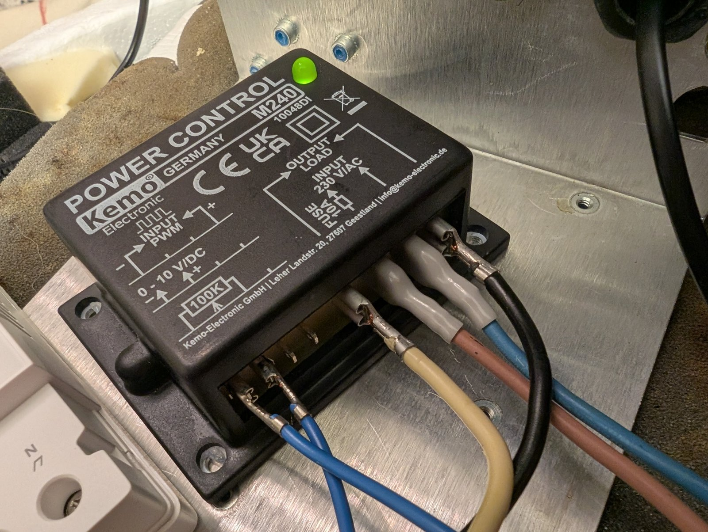
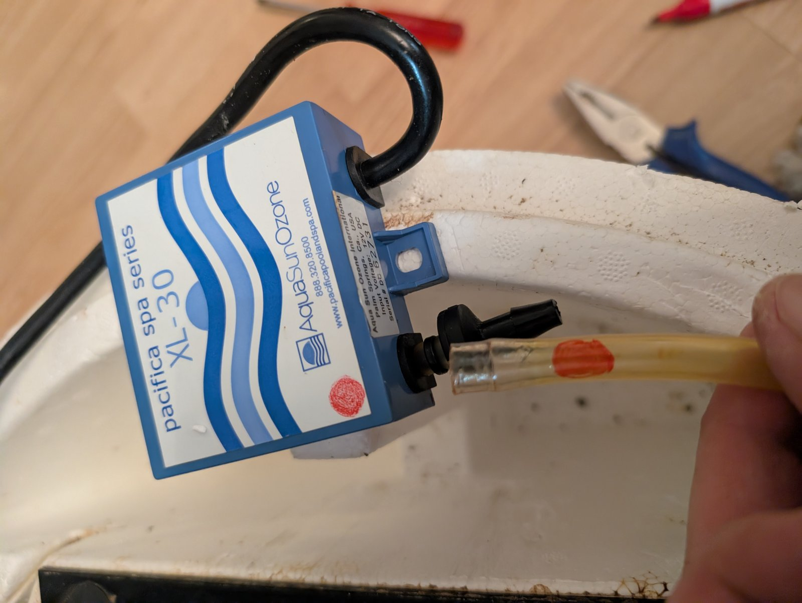
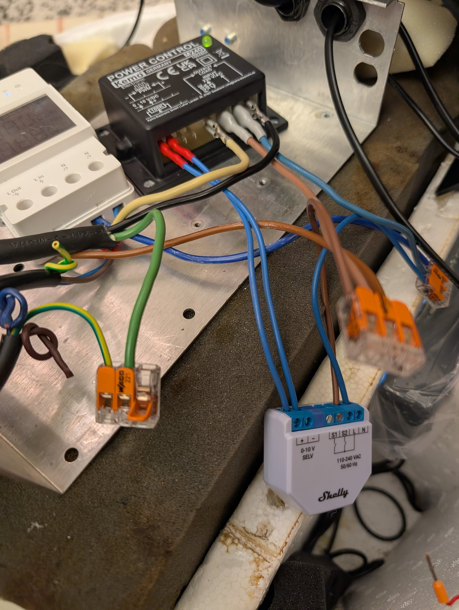

# Build Guide

A walkthrough of the conversion in the order it was actually done. Read the [Disclaimer & Safety](../README.md#disclaimer--safety) section in the README first.

## 1. Remove the Original Electronics

Unplug the whirlpool. Wait at least 5 minutes and discharge any capacitors before touching anything.

Photograph and label every wire before disconnecting it — the original board's labelling (relay, transformer, valve) is not obvious once it's in pieces. Remove:

- The main control PCB (Softub Inc., marked "C-2013" on the unit used here)
- The Zettler relay (rated 220V coil, 30A/277VAC contacts — this was the switching element for the pump)

- The Isonic solenoid valve (12VDC, normally-closed — part of the original ozone circuit, no longer needed since the new 220V ozonator connects directly to the existing Venturi injector)

- The Aquatemp transformer (230V primary, 12V secondary — only powered the control logic, not the motor)
- The original AquaSunOzone XL-30 ozonator (12V DC — replaced by a new 220V passive unit that doesn't need the transformer)

None of these are reused. The original pool LED light was also not re-installed — it would have required additional components (driver, controller) for little practical benefit.

## 2. Mount the Terminal Block

Install on the left side of the motor housing, positioned so all downstream components can reach it with reasonably short runs. This is the single point all new wiring radiates from — getting its position right first makes everything after it easier.

## 3. Wire the Capacitor

- Mount the new capacitor on the left side of the housing, next to the terminal block.
- Confirm capacitance and voltage rating against the motor's original capacitor or nameplate spec (this build used 20µF / 450VAC as a replacement).
- Crimp insulated 6.3mm spade connectors onto the motor and capacitor leads — see [COMPONENTS.md](COMPONENTS.md) for crimping tool/die notes.
- The capacitor has two electrically-identical spade terminal pairs per side; use one per side and insulate the unused spare with heat shrink, since it sits exposed inside a housing that does see condensation.

## 4. Wire the Sonoff TH Elite

- Terminal block L/N → TH Elite IN-L/IN-N
- TH Elite OUT-L/OUT-N → downstream to the Shelly/Kemo chain and the ozonator (see wiring diagram)
- DS18B20 → TH Elite's dedicated sensor input
- Mount the DS18B20 probe in the same position where the original temperature sensor sat, sealed in place with silicone to keep it waterproof and in direct contact with the water

## 5. Wire the Shelly Dimmer 0/1-10V PM Gen3

- TH Elite OUT-L/OUT-N → Shelly L/N (the Shelly needs its own mains supply to be able to output a signal at all — this is easy to miss, since the app will happily show a percentage value even with zero volts actually present on the output if the device itself isn't powered)
- Shelly 0–10V output (+ / –) → Kemo's 0–10V signal input
- Configure the Shelly app settings — see [APP-SETTINGS.md](APP-SETTINGS.md) for details

## 6. Wire the Kemo M240

- Shelly's 0–10V output → Kemo's "0-10V/DC" input terminals (the small left-hand pair — easy to overlook on first glance, since most of the visible wiring on this device sits on the right-hand 230V side)
- TH Elite's switched output → Kemo "INPUT 230VAC"
- Kemo "OUTPUT LOAD" → pump motor live
- Pump motor neutral → terminal block neutral (shared with everything else)

## 7. Wire the Ozonator

<!-- TODO: add photo of new 220V passive ozonator installed on right side -->

- Mount the ozonator on the right side of the housing.
- Wire it to the TH Elite's switched output (fixed 230V), so it receives power whenever the TH Elite is on and the pump is running.
- Connect the ozonator's air output to the existing ozone tubing. The Venturi injector and check valve in the water line are original Softub parts and stay in place — only the ozonator unit itself is replaced.

- This ozonator has no internal air pump — it cannot push ozone into still water. If it's tested with the pump off and "nothing seems to happen," that's expected: test by holding the open end of the air tubing under water with the pump running.

## 8. Wire the Tuya W218 Water Analyzer

- Mount the Tuya W218 on the right side of the housing.
- The W218 runs on 24V via its own power adapter — use a short extension cable to reach the nearest mains outlet from the terminal block.
- Tap power directly from the terminal block (own L/N leads), independent of the TH Elite switched circuit, so it stays on even when the pump cycle is off.
- pH, ORP, and TDS probes go into the pool water.
- The temperature probe in this build does **not** go into the water — see [COMPONENTS.md](COMPONENTS.md) for why it's mounted on the Kemo housing instead. Mount it wherever you actually want it measuring.

## 9. Final Assembly

- Route all 230V wiring and all low-voltage signal/sensor wiring with as much physical separation as the enclosure allows.
- Every junction inside the housing goes through a sealed gel-box connector (Wago) — condensation inside this enclosure is routine, not an edge case.
- Pack foam/padding material where needed to keep components from rattling against the housing or each other — offcuts work fine, this doesn't need to be pretty.

## 10. Test Before Refilling

1. With the whirlpool still empty of water, plug in and verify the TH Elite powers on and its display/app shows correctly.
2. Check the Shelly app connects and reports status.
3. Briefly run the pump dry (a few seconds only) to confirm rotation and that nothing smells hot or sounds wrong, then stop before any heat buildup.
